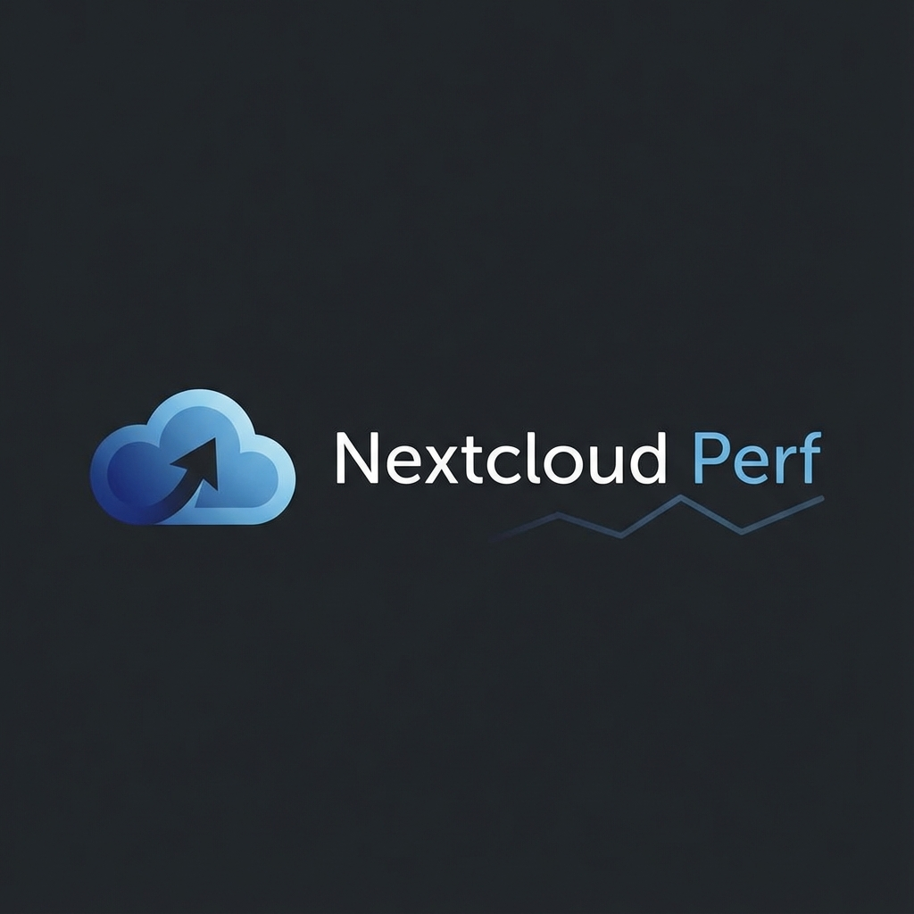
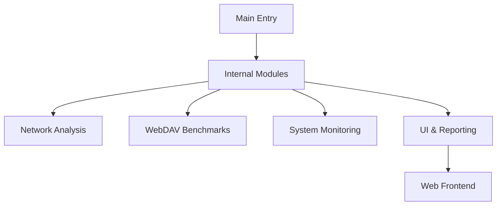

<p align="center">
  
</p>

<h1 align="center">Nextcloud Perf</h1>

<p align="center">
  <strong>Ein leistungsstarkes Toolset zur detaillierten Performance-Analyse und Benchmarking von Nextcloud-Instanzen.</strong>
</p>

<p align="center">
  
  
  
</p>

---

## 🚀 Überblick

`nextcloud-perf` hilft dir dabei, Engpässe in deiner Nextcloud-Umgebung zu identifizieren. Ob Netzwerklatenz, langsame WebDAV-Operationen oder Ressourcenmangel auf dem Server – dieses Tool liefert dir die nötigen Daten direkt in einer übersichtlichen Weboberfläche.

## ✨ Kernfunktionen

| Kategorie | Features |
| :--- | :--- |
| **🌐 Netzwerk** | Latenz- & Bandbreitenmessung, DNS-Check, Traceroute, Speedtest.net Integration |
| **📁 WebDAV** | Benchmarking von Upload/Download-Geschwindigkeiten für kleine, mittlere und große Dateien |
| **🖥️ System** | Ressourcenüberwachung (CPU, RAM, Disk) und Analyse von Server-Informationen |
| **📊 Reporting** | Interaktives Web-Dashboard zur Live-Auswertung und Generierung von HTML-Reports |

---

## 🛠️ Installation & Setup

### Voraussetzungen
* **Go** 1.21 oder neuer (Empfohlen: Go 1.24 für beste Performance)
* Ein lauffähiger Nextcloud-Server für WebDAV-Tests

### In 3 Schritten startklar

1. **Repository klonen:**
   ```bash
   git clone https://github.com/xxroxxerxx/nextcloud-perf.git
   cd nextcloud-perf
   ```

2. **Binary bauen:**
   ```bash
   go build -o nextcloud-perf main.go
   ```

3. **Starten:**
   ```bash
   ./nextcloud-perf
   ```
   *Die Weboberfläche öffnet sich automatisch unter [http://localhost:3000](http://localhost:3000).*

---

## 📖 Nutzung

### Web-Oberfläche (Empfohlen)
Das Tool startet standardmäßig einen lokalen Webserver. Über das Dashboard kannst du:
- Benchmarks mit einem Klick starten.
- Konfigurationen für deine Nextcloud-Instanz (URL, User, Password) hinterlegen.
- Historische Ergebnisse vergleichen.

### Kommandozeile
Für Automatisierung oder schnelle Checks bietet `nextcloud-perf` hilfreiche Flags:

```bash
./nextcloud-perf --help
```

---

## 🏗️ Architektur & Struktur

Das Projekt ist modular aufgebaut, um Erweiterbarkeit zu gewährleisten:



- `internal/` – Die Logik der verschiedenen Testmodule.
- `web/` – HTML/JS/CSS für das interaktive Dashboard.
- `main.go` – Der "Kleber", der alles verbindet.

---

## 📄 Lizenz

Dieses Projekt ist unter der MIT-Lizenz lizenziert. Weitere Details findest du in der [LICENSE](LICENSE)-Datei.

---

<p align="center">
  <sub>Entwickelt mit ❤️ für die Nextcloud-Community.</sub>
</p>